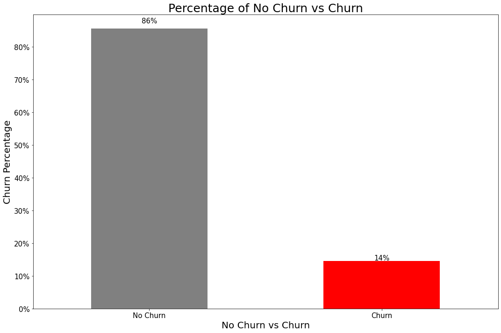
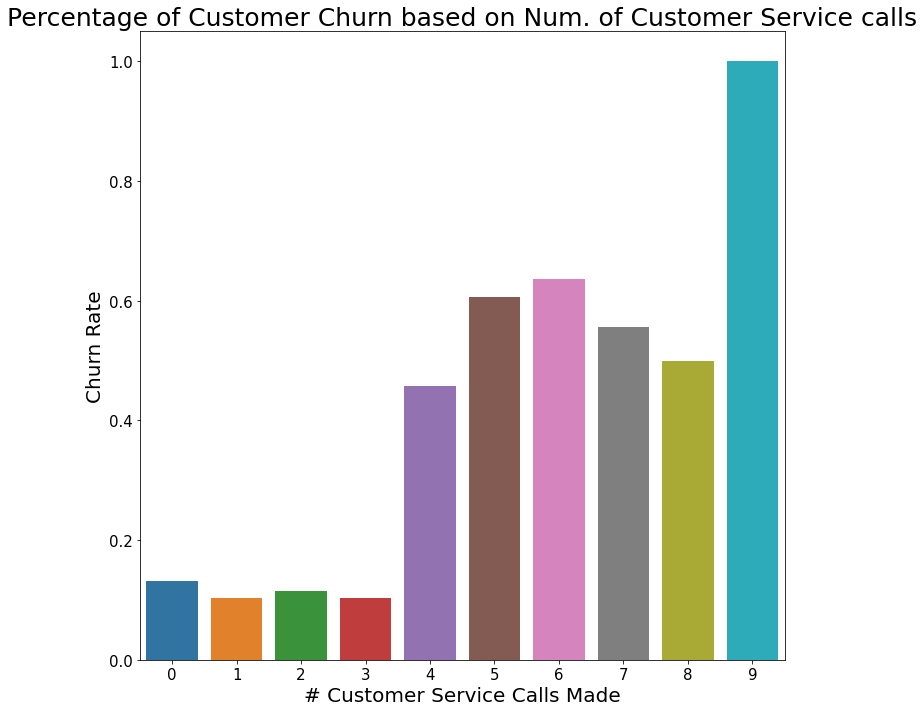
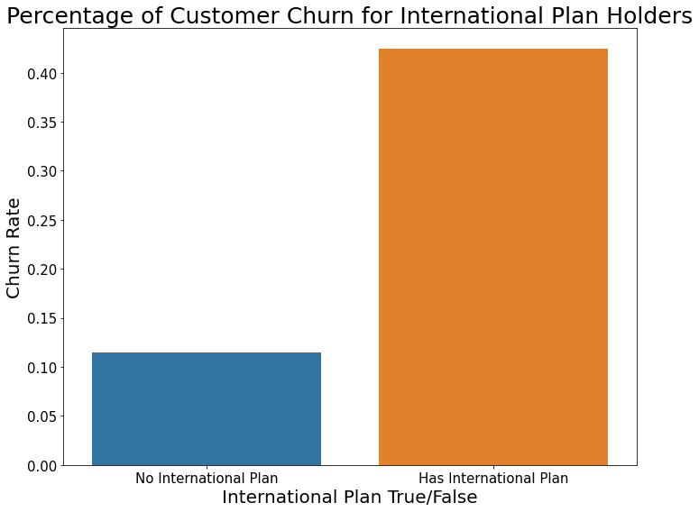
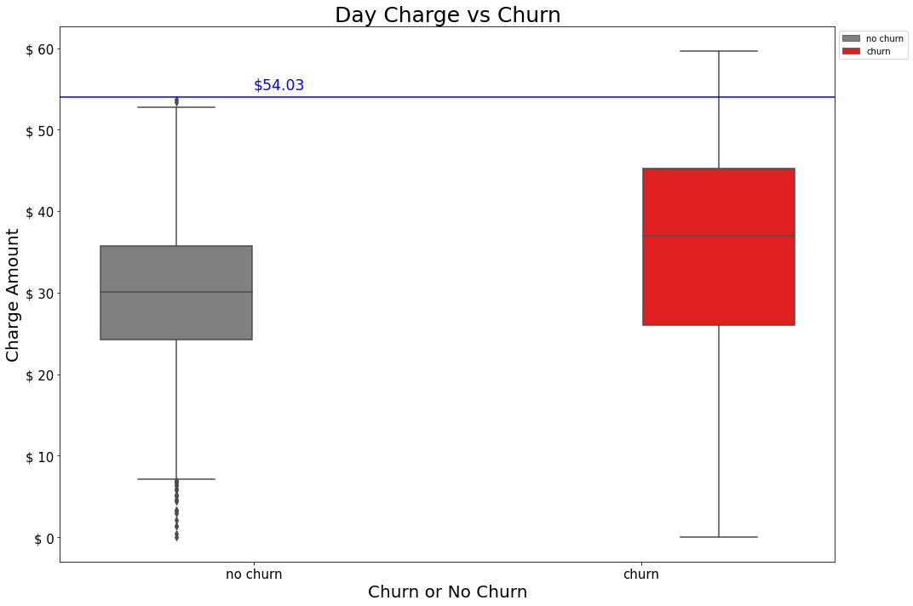

# Syria Telecommunication Customer Churn

**Data Scientist**: Anhduy (Andy) Nguyen, Woojin Jun

**Date**: June 3, 2022

```
.
├── README.md
├── data
│   └──  bigml_59c28831336c6604c800002a.csv
├── OldNotebooks
|   ├──AndyNotebook.ipynb
|   ├──WJ_note.ipynb
|   └──WJ_note2.ipynb
├── img
│   ├── ChurnPercentage.png
│   ├── Customer_Service_Call_Churn.png
│   ├── Distribution_Total_Day_Charge.png
│   ├── FeatureImportance.png
│   ├── International_Plan_Churn.png
│   └── Percentage_Customer_Churn.png
├── .gitignore
├── SyriaTelecommunication.ipynb
├──
└──
```
## Business Understanding
Syria Telecommunications a telecom company has expressed interest in increasing customer retention/reducing customer churn for their user base. They have reached out to us a cohort of trained data scientists to recommend an optimized strategy to decrease customer churn. This analysis will use different statistical analysis tool and classifiers including, but not limited to, logistic regression, train-test split, OneHotEncoder, cross-validation, and decision trees to find what features have the highest impact on customer churn.

## Business Problem
Reducing Customer Churn

### Three Key Features
- What are the effects of customer service calls on customer churn?
- Does the charge on customers during the day effect customer churn?
- Does having or not having an international plan effect customer churn?

## Data Understanding
The main data set that was used was the Syria Telecommunication data set named ('data/bigml_59c28831336c6604c800002a.csv'). The data set was then cleaned before analysis was run on it.

### Data Features
- State 
- Account Length 
- Area Code 
- Phone Number
- International Plan(Yes or No)
- Voice Mail Plan(Yes or No) 
- Number of Voice Mail Messages 
- Total of Day, Evening, Night, and International Minutes
- Total of Day, Evening, Night, and International Calls
- Total of Day, Evening, Night, and International Charges
- Number of Customer Service Calls 
- Churn(Yes or No)

## Methodology & Results
1. Our base model was a Dummy Model
2. OneHotEncoded States, SMOTE to even out the unbalanced data from a ratio of 85:15 No Churn : Churn to around 74 : 26, and StandarScaler to scale data
3. Ran a DecisionTreeClassifier to find best features(International Plan, Voice Mail Plan, Total Day Minutes, Total Day Charge, Total Evening Minutes, Total Evening Calls, Total Evening Charge, Total Night Minutes, Total Night Charge, Total International Minutes, Total International Calls, Customer Service Calls)
4. Ran EDA on the top three features(Customer Service Call, International Plan, Total Day Charge)
5. Ran three base model classifiers(Decision Tree, K Nearest Neighbors, and Logistic Regression) on best features
6. Reran the three classifiers on best features with GridSearchCV to find the best parameters
7. Chose best model based on highest Recall Score because reducing the likelyhood of FN or customers identified as non churn candidates that actuall do churn to increase customer retention
8. Best Model final Scores Accuracy: 92.93%, Recall: 80.8%, Precision: 74.26%, F1 Score: 77.39%, and AUC score of 97%. Scores vary by a couple of percentage point when notebook is reran because of SMOTE Data.

## Graphs



Original Data had a Churn percentage of 14% for all customers in the data set



Shows that Customer Churn percentage increased as customer service call increased with the a 35% jump between 3 and 4 customer service call and a 100% churn at 9 service calls.



42% of customer who used the International Plan Churned



After the $54.03 threshold all customer churned.

## Conclusions/Reccomendations
1. Research should be done on why Customer Service was called so many time by users and why it wasn't fixed in the first few occurences to reduce Churn.
2. Research on why users with an International Plan have such a high churn rate of 42% and what the underlaying factors of the International plan that cause this. Mimic plan from competitive telecom company with low churn rate.
3. Investigate why the churn rate was 100% for users that spent more the $54 dollars on day time charges. Introduce a lower rate for day time charges to increase customer retention or have promotions for users that spend over 50.

## Next Steps
1. Data specifically detailing demographic data of the consumer would be helpful. It will show the ages groups, genders, possibly income level. The features could have a huge importance on data churn and will provide information so that we can send promotions targeted to specific groups that are more likely to churn or reward demographics that are unlikely to churn.
2. Have more information on the type of customer that utilizes this telephone company because Syria Telecommunications is a Syrian Telecommunications company, but the data set only showed American based users.
3. More information on specifically the reasons for the customer service calls to see if there where repeat incidents or multiple separate incidences.

##
Email:
- [Anhduy Nguyen](anguyen61191@gmail.com)
- [Woojin Jun](wjsdnwls93@gmail.com)

GitHub:
- [Anhduy Nguyen](https://github.com/anguyen61191)
- [Woojin Jun](https://github.com/WoojinJun)

LinkedIn
- [Anhduy Nguyen](https://www.linkedin.com/in/anhduy-nguyen-217402149/)
- [Woojin Jun](https://www.linkedin.com/in/woojin-jun-6029bb114/)